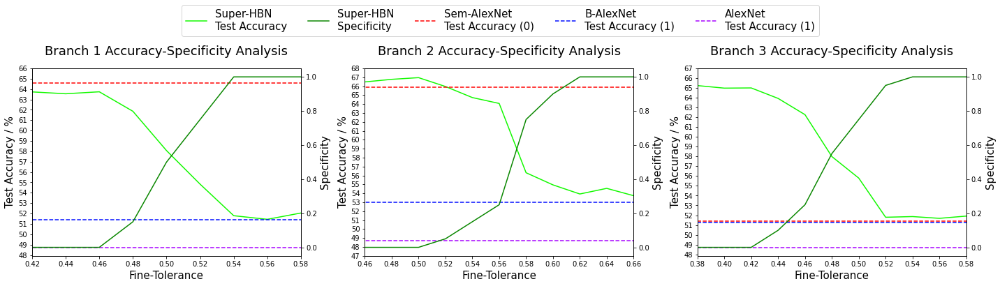

 &emsp;
 &emsp;
 &emsp;
 &emsp;
 &emsp;


Table of Contents
=================

* [Leveraging of Class Granular Classifications with Dynamic DNNs - P3 Individual Project](#leveraging-of-class-granular-classifications-with-dynamic-dnns---p3-individual-project)
   * [Motivation](#motivation)
   * [Achievements](#achievements)
   * [Run](#run)
   * [Final Report](#final-report)
      * [References](#references)
      * [License](#license)

# Leveraging Class Granular Classifications with Dynamic DNNs

Recent advancements in deep learning have achieved exceptional performance on the multi-class classification problem. However, these techniques are often computationally expensive and incur undesired latency overheads. To mitigate these effects, DyNNs were proposed as an architectural modification to vanilla DNNs, allowing for the dynamic scaling of compute at run-time.

Although DyNNs successfully alter computational overheads at run-time based on problem complexity, they assume that each problem has only one acceptable solution, thus one acceptable semantic complexity. Semantically, however, each image has a variety of acceptable classifications; for the multi-class classification problem, in particular, there are a set of solutions found within the semantic hierarchy, such as $\{\text{poodle, dog, animal}\}$.

This paper highlights the importance of hierarchical learning by investigating the impact of dynamic granularity adjustments within the context of classification. This investigation is performed within the framework of a novel early-exiting architecture named Gran-HBN.

<p align="center">
  
   <em>Gran-HBN accuracy/specificity trade-off for the different branches</em>
</p>

Gran-HBN is used for a thorough analysis of the accuracy/specificity trade-off to be performed and is used to show that the classification uncertainty decreases for both coarse and fine classifications as we delve deeper into the model.

There are, however, overlaps in both fine label and coarse label classification uncertainties at each exit (note, however, that the fine label uncertainty is likely still higher than that of its coarse counterpart). This suggests that fine classifications within the coarse uncertainty region can be confidently made at early exits, implying that we can increase classification specificity while maintaining coarse classification accuracies at a given exit.

<p align="center">
  
   <em><br />The fine and coarse classification entropies at each branch</em>
</p>

This leads to the development of a model that automatically tunes the classification granularity based on the input image. As a result, a trade-off between accuracy and specificity emerges, enabling earlier branches to achieve late-level classification accuracy while utilizing fewer computational resources and negligible latency impact.

<p align="center">
  
   <em>Comparison plot of all trained models</em>
</p>

## Run

0. Requirements:
    * python3.7, pytorch 1.11, torchvision 0.12.0, cuda 11.3, cudnn 8.2.0
    * Prepare CIFAR-100 dataset
1. Model Use:
    * All saved models are stored as *.pth* files in the [models](/Analysis/models) folder
    * The method of analysis for all models used in the final report can be found in [SUITE.py](/Analysis/SUITE.py), with the results and the corresponding metadata used to produce the results in [ResultsAnalysis](/Analysis/ResultsAnalysis)
    * To use the trained models, instance the corresponding network definition in [network_def.py](/Analysis/utils/network_def.py) and then use the following code to load the trained model
    ```
    model = ModelClass().to(device)
    model.load_state_dict(torch.load(results/models/{model}.pth))
    model.eval()
    ```
2. Training:
    * Navigate to the **MAKE** folder and `chmod` the **run.sh** file, running it with `./run.sh`
    * Arguments for training, with their corresponding default values in brackets, include
        * --mode : "training" or "testing" ("training")
        * --batch_size : int (256)
        * --lr : float (1e-3)
        * --weight_decay : float (1e-4)
        * --device : 'cuda' or 'cpu' ('cuda')
        * --num_epochs : int (2)

## Paper

Find the [paper here](/docs/Gran_HBN_Paper.pdf).

### License

Licensed under the [MIT License](LICENSE).

---
